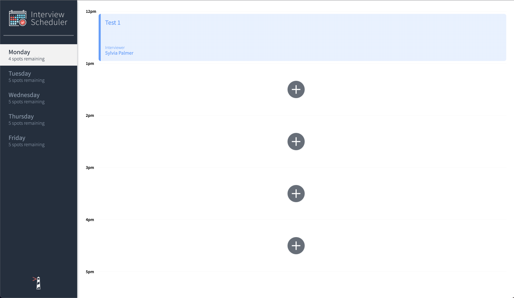

# Interview Scheduler

## Setup

Install dependencies with `npm install`.

## Running Webpack Development Server

```sh
npm start
```

## Running Jest Test Framework

```sh
npm test
```

## Running Storybook Visual Testbed

```sh
npm run storybook
```

# Interview Scheduler Project

Scheduler is a full stack application built with tech stack : React , Express , Node , PostgreSQL
This app allows any user to come on. Choose a certain day and book an appointment.
If can also remove an appointment or edit an existing appointment.
This will be demonstrated below

## Deployment

-Heroku/Netlify
https://asiddev-scheduler.netlify.app

## Github

https://github.com/Asiddev/scheduler

## Dependencies

-axios

-@testing-library/react-hooks

-react-test-renderer

-classnames

-react

-express

-node

-psql

## Testing

-Cypress

-Jest

-Coverage Tests (COVERED)

## Using Interview Scheduler

1.Welcome to Interview Scheduler. On the front page you will be able to see a sidebar with the days and the spots avaliable for each day. A white background lets the user know that that is the current selected day. Next to that , depending on the day seelcted you will see appointments if booked or a emply slot with a plus sign. Clicking on this plus sign will allow you to create an appointment with a certain interviewer.



2. You can hover over any existing appointment to see the edit and delete button in the bottom right.

   

3. Once you click edit. You will be brought to the editing view. You can change the name or change an interviewer.

   

4.Once you have finished editing your interview you can click save and your request will take a second. So you should see a saving buffer.


If theres an error

5. If you choose to delete an appointment. You will see the confirmation view.


5. Once you confirm you will see a deleting buffer and an empty appointment at the slot you just deleted.


6. Thank you for visiting Interview Scheduler. I hope you enjoyed the app! d
